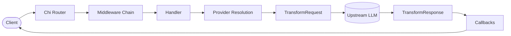
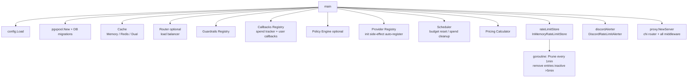
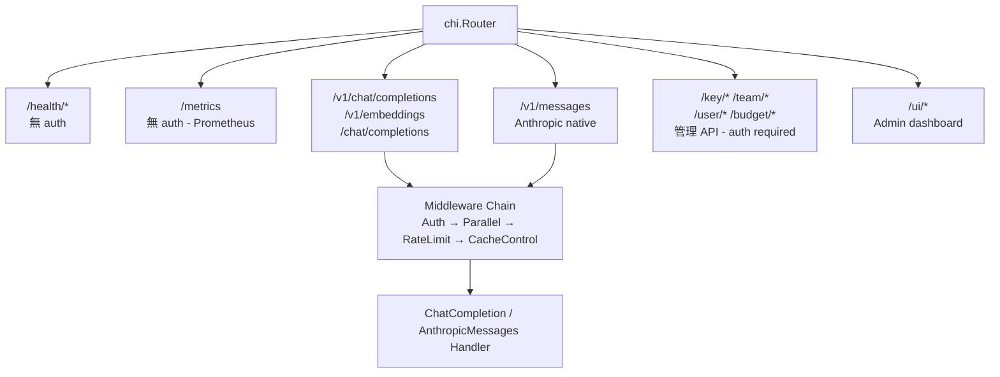
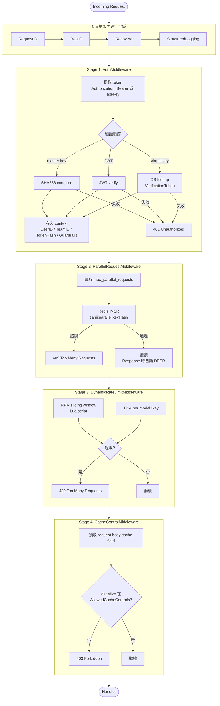
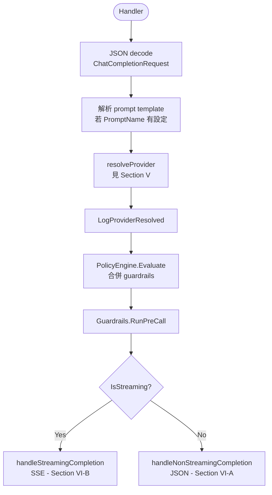
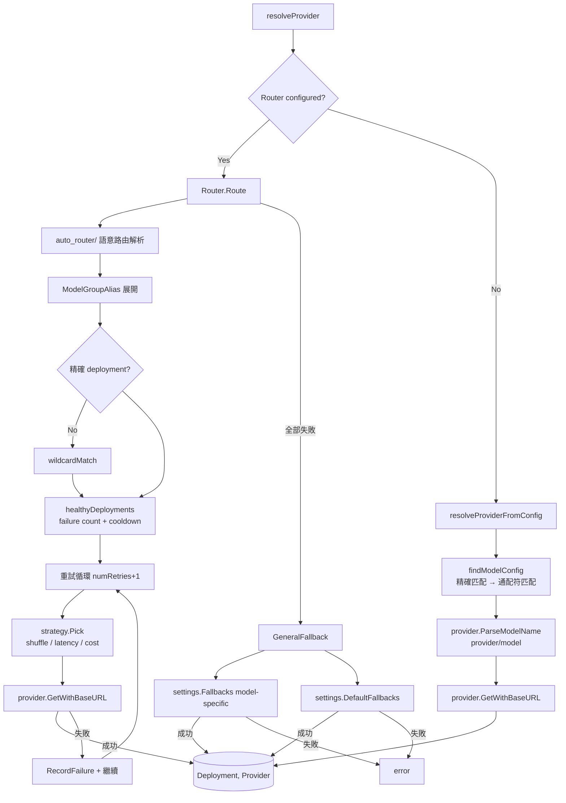
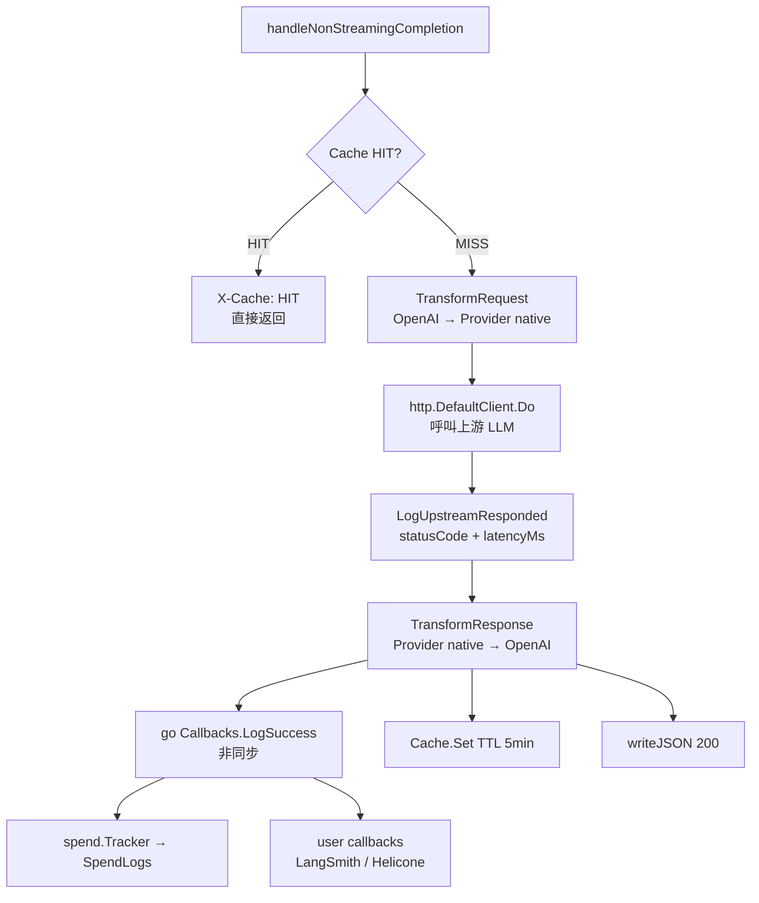
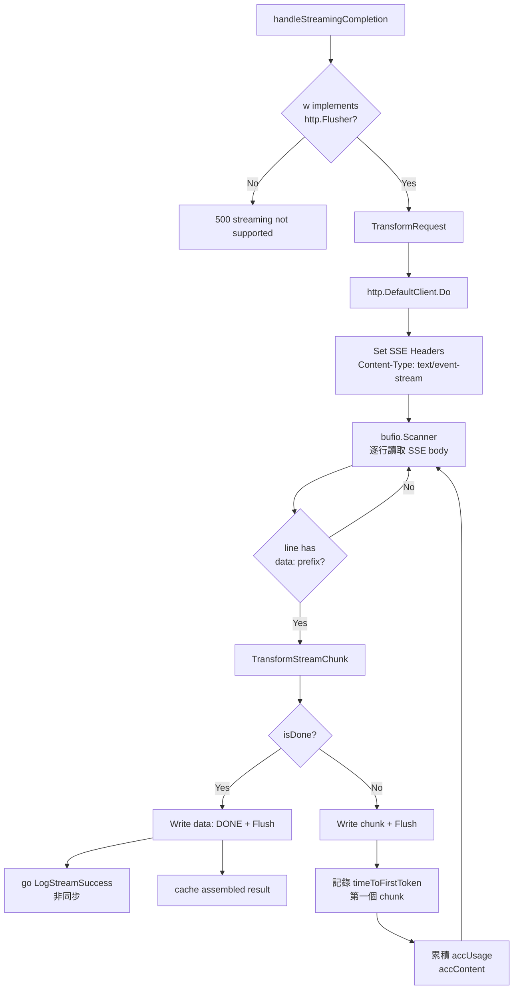
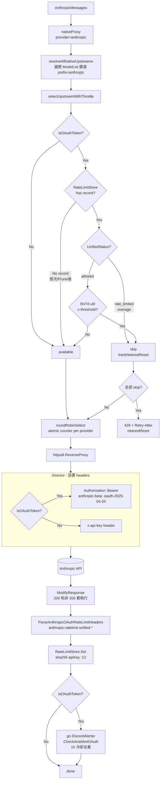

# TianjiLLM 完整 Request Flow

## 概述



---

## 一、啟動初始化 (`cmd/tianji/main.go`)



**Provider 自注冊模式**：所有 provider 透過 `import _` 的 side-effect，在 `init()` 中呼叫 `provider.Register("name", instance)`，無需中央枚舉。

---

## 二、路由結構 (`internal/proxy/server.go`)



---

## 三、Middleware Chain（執行順序）



---

## 四、Handler 執行 (`internal/proxy/handler/chat.go`)



---

## 五、Provider Resolution



---

## 六、Provider Transform + Upstream 呼叫

### VI-A 非流式（Non-Streaming）



### VI-B 流式（Streaming / SSE）



---

## 七、Anthropic Native Proxy（OAuth Token 多 Token 管理）

`POST /v1/messages` 走獨立路徑，不經過 `ChatCompletion` handler。



詳見 [oauth-token-strategy.md](./oauth-token-strategy.md)。

---

## 八、錯誤處理

| 位置 | HTTP 狀態碼 | 觸發條件 |
|------|------------|---------|
| AuthMiddleware | 401 | token 缺失或無效 |
| ParallelMiddleware | 409 | max_parallel_requests 超限 |
| RateLimitMiddleware | 429 | RPM/TPM 超限 |
| CacheControlMiddleware | 403 | cache directive 未授權 |
| resolveProvider | 404 | model 找不到 |
| resolveProvider | 403 | access denied |
| TransformRequest | 500 | provider 轉換失敗 |
| Upstream HTTP | pass-through | 上游回傳錯誤 |
| TransformResponse | 502 | response 解析失敗 |
| selectUpstreamWithThrottle | 429 | 全部 OAuth token throttled |

所有失敗都會觸發：
```go
h.logFailure(ctx, req, p, startTime, err)
  ├─ recordErrorLog(ctx, ...) → INSERT ErrorLogs（同步）
  └─ go h.Callbacks.LogFailure(data)（非同步）
```

---

## 九、完整流程時間軸

```mermaid
sequenceDiagram
    participant C as Client
    participant CHI as Chi Router
    participant AUTH as AuthMiddleware
    participant PAR as ParallelMW
    participant RL as RateLimitMW
    participant CC as CacheControlMW
    participant H as Handler
    participant PR as Provider Resolution
    participant P as Provider
    participant UP as Upstream LLM
    participant CB as Callbacks

    C->>CHI: POST /v1/chat/completions
    CHI->>AUTH: forward
    AUTH-->>C: 401 (token invalid)
    AUTH->>PAR: token valid
    PAR-->>C: 409 (parallel limit)
    PAR->>RL: ok
    RL-->>C: 429 (RPM/TPM exceeded)
    RL->>CC: ok
    CC-->>C: 403 (cache directive denied)
    CC->>H: ok

    H->>PR: resolveProvider(modelName)
    PR-->>H: (Provider, apiKey, model)

    alt Non-Streaming
        H->>P: TransformRequest
        P->>UP: HTTP Request
        UP-->>P: HTTP Response
        P->>H: TransformResponse
        H-->>C: JSON 200
        H->>CB: go LogSuccess (async)
    else Streaming
        H->>P: TransformRequest
        P->>UP: HTTP Request
        loop SSE chunks
            UP-->>P: chunk
            P->>H: TransformStreamChunk
            H-->>C: data: {...}\n\n (Flush)
        end
        UP-->>P: [DONE]
        H-->>C: data: [DONE]\n\n
        H->>CB: go LogStreamSuccess (async)
    end

    CB->>CB: spend.Tracker → SpendLogs
    CB->>CB: user callbacks (optional)
```

---

## 十、關鍵檔案索引

| 檔案 | 職責 |
|------|------|
| `cmd/tianji/main.go` | 啟動、依賴注入、wiring |
| `internal/proxy/server.go` | chi router、middleware 註冊 |
| `internal/proxy/handler/chat.go` | ChatCompletion handler、流程編排 |
| `internal/proxy/handler/handler.go` | Provider resolution、`resolveProviderFromConfig` |
| `internal/proxy/handler/native_format.go` | Anthropic native proxy、`ModifyResponse` |
| `internal/proxy/handler/native_upstream.go` | `selectUpstreamWithThrottle`、round-robin |
| `internal/proxy/middleware/auth.go` | Authentication、虛擬 key |
| `internal/proxy/middleware/parallel.go` | Parallel request limiting |
| `internal/proxy/middleware/ratelimit.go` | RPM/TPM limiting（Redis Lua） |
| `internal/proxy/middleware/cache_control.go` | Cache directive 驗證 |
| `internal/router/router.go` | 多 deployment 路由、重試、健康檢查 |
| `internal/router/fallback.go` | GeneralFallback / ContextWindowFallback / ContentPolicyFallback |
| `internal/provider/provider.go` | Provider interface 定義 |
| `internal/callback/ratelimit_store.go` | `InMemoryRateLimitStore`、OAuth token 狀態 |
| `internal/callback/discord_ratelimit.go` | Discord 告警、1h 冷卻去重 |
